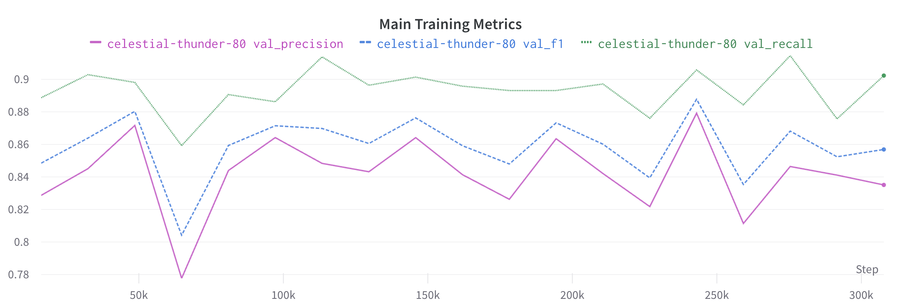
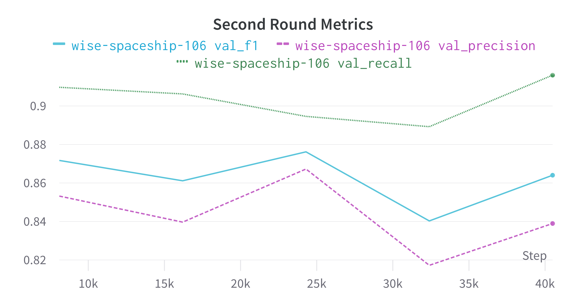

# hlc-polyp-detection
Hidden Layer Cake - Computer Vision for Colonoscopy Polyp Detection 

# Contents
  ## FasterRCNN
> This was the first FasterRCNN model trained on the Kaidong dataset, important files include:
 + Training notebooK: `FasterRCNN_working_executed.ipynb` 
 + Evaluation notebook `FasterRCNN_evaluation.ipynb`
 + Saved model weights in `weights ` directory
 + PyTorch FasterRCNN model `old_src/model.py`  
 + Torch Dataset/Dataloader `old_src/PolypsDataset.py`
 + Also contains a `README.md`
  
  ## LightningFasterRCNN
  ### This is the model used for the two "Big Runs" on the large dataset, 

  #### Re-wrote the framework for the model using `pytorch-lightning` to utilize callback and logging fucntionality and increase modularity. 
  + Training notebook with outputs from most recent run `LightningFastRCNN-polyps.ipynb`
  + Evaluation notebook `LightningEvalutator.ipynb`
  + Lightning module definition + callback `src/LightningFasterModule`
  + New dataset class with minor optimizations to `__getitem()__`  and support all images `src/PolysDataset`
  + Lightning datamodule `src/PolypsPLDataModule`
  ## Results from this model:

  ## First Pass of Faster-RCNN on 43k image dataset:
```
┏━━━━━━━━━━━━━━━━━━━━━━━━━━━┳━━━━━━━━━━━━━━━━━━━━━━━━━━━┓
┃        Test metric        ┃         Score             ┃
┡━━━━━━━━━━━━━━━━━━━━━━━━━━━╇━━━━━━━━━━━━━━━━━━━━━━━━━━━┩
│         test_acc          │    0.6349629759788513     │
│          test_f1          │    0.7314706444740295     │
│      test_precision       │    0.8447203040122986     │
│        test_recall        │    0.6987577676773071     │
└───────────────────────────┴───────────────────────────┘
```



## Second Pass of Faster-RCNN on 43k image dataset:
```
┏━━━━━━━━━━━━━━━━━━━━━━━━━━━┳━━━━━━━━━━━━━━━━━━━━━━━━━━━┓
┃        Test metric        ┃         Score             ┃
┡━━━━━━━━━━━━━━━━━━━━━━━━━━━╇━━━━━━━━━━━━━━━━━━━━━━━━━━━┩
│         test_acc          │     0.598007082939148     │
│          test_f1          │    0.6866463422775269     │
│      test_precision       │    0.7771736979484558     │
│        test_recall        │    0.6622670888900757     │
└───────────────────────────┴───────────────────────────┘
```




  ## FCOS_polyp_detection
  > Last minute attempt to train an FCOS model that didn't go well. 


# Data
 Data directory is not included in the repository due to both size and privacy concerns for some data. 
## New data directory structure diagram 
```
data/
├── all_labels.csv
├── CVC-ClinicDB/
│   ├── test/ --> x110
│   │   └── img_CVC-ClinicDB_test.png......... 110
│   ├── train/
│   │   └── img_CVC-ClinicDB_train.png........ 427
│   └── validation/
│       └── img_CVC-ClinicDB_validation.png... 75
├── ETIS-LaribPolypDB/
│   └── test/
│       └── img_ETIS-LaribPolypDB_test.png.... 196
├── Kaidong/
│   ├── test/
│   │   └── img_Kaidong_test.png.............. 4630
│   ├── train/
│   │   └── img_Kaidong_train.png............. 28773
│   └── validation/
│       └── img_Kaidong_validation.png........ 4630
├── Kvasir/
│   ├── test/
│   │   └── img_Kvasir_test.png............... 991
│   └── validation/
│       └── img_Kvasir_validation.png......... 1
└── Piccolo/
    ├── test/
    │   └── img_Piccolo_test.png.............. 666
    ├── train/
    │   └── img_Piccolo_train.png............. 3058
    └── validation/
        └── img_Piccolo_validation.png........ 897
```


### TODO
- [x] Update PolypDataset class to handle more complex hierarchy
- [x] Integrate PyTorch Lightning:
  - [x] Create Lightning data module
  - [x] Create Lightning model
  - [x] ~~Config file~~ Config dict in notebook
  - [x] Callbacks and autotune model -- just learning rate
  - [x] Multi-GPU support -- there but not used


## Verbose Summary of Faster-RCNN Network 
(there's nothing else important below here....)
|   | Name                                       | Type                     | Params|
|---|--------------------------------------------|--------------------------|-------------|
|0  | detector                                   | FasterRCNN               | 43.3 M|
|1  | detector.transform                         | GeneralizedRCNNTransform | 0     |
|2  | detector.backbone                          | BackboneWithFPN          | 26.9 M|
|3  | detector.backbone.body                     | IntermediateLayerGetter  | 23.5 M|
|4  | detector.backbone.body.conv1               | Conv2d                   | 9.4 K |
|5  | detector.backbone.body.bn1                 | BatchNorm2d              | 128   |
|6  | detector.backbone.body.relu                | ReLU                     | 0     |
|7  | detector.backbone.body.maxpool             | MaxPool2d                | 0     |
|8  | detector.backbone.body.layer1              | Sequential               | 215 K |
|9  | detector.backbone.body.layer2              | Sequential               | 1.2 M |
|10 | detector.backbone.body.layer3              | Sequential               | 7.1 M |
|11 | detector.backbone.body.layer4              | Sequential               | 15.0 M|
|12 | detector.backbone.fpn                      | FeaturePyramidNetwork    | 3.3 M |
|13 | detector.backbone.fpn.inner_blocks         | ModuleList               | 985 K |
|14 | detector.backbone.fpn.layer_blocks         | ModuleList               | 2.4 M |
|15 | detector.backbone.fpn.extra_blocks         | LastLevelMaxPool         | 0     |
|16 | detector.rpn                               | RegionProposalNetwork    | 1.2 M |
|17 | detector.rpn.anchor_generator              | AnchorGenerator          | 0     |
|18 | detector.rpn.head                          | RPNHead                  | 1.2 M |
|19 | detector.rpn.head.conv                     | Sequential               | 1.2 M |
|20 | detector.rpn.head.cls_logits               | Conv2d                   | 771   |
|21 | detector.rpn.head.bbox_pred                | Conv2d                   | 3.1 K |
|22 | detector.roi_heads                         | RoIHeads                 | 15.2 M|
|23 | detector.roi_heads.box_roi_pool            | MultiScaleRoIAlign       | 0     |
|24 | detector.roi_heads.box_head                | FastRCNNConvFCHead       | 15.2 M|
|25 | detector.roi_heads.box_head.0              | Conv2dNormActivation     | 590 K |
|26 | detector.roi_heads.box_head.1              | Conv2dNormActivation     | 590 K |
|27 | detector.roi_heads.box_head.2              | Conv2dNormActivation     | 590 K |
|28 | detector.roi_heads.box_head.3              | Conv2dNormActivation     | 590 K |
|29 | detector.roi_heads.box_head.4              | Flatten                  | 0     |
|30 | detector.roi_heads.box_head.5              | Linear                   | 12.8 M|
|31 | detector.roi_heads.box_head.6              | ReLU                     | 0     |
|32 | detector.roi_heads.box_predictor           | FastRCNNPredictor        | 10.2 K|
|33 | detector.roi_heads.box_predictor.cls_score | Linear                   | 2.0 K |
|34 | detector.roi_heads.box_predictor.bbox_pred | Linear                   | 8.2 K |


43.3 M    Trainable params
0         Non-trainable params
43.3 M    Total params
173.025   Total estimated model params size (MB)


## Faster RCNN Polyp Detection Module

### Extracting FasterRCNN data directory from data.zip:
***Make sure the data dir is in `.gitignore`!!!***
+ unzip contents and place in the same directory as `FasterRCNN_working.ipynb`
+ make sure the path is correct: 
+ should match the diagram below, not `./data/data`
```
data/
    ├── test/
    │   ├── test_labels.csv
    │   │   
    │   └── images/
    │       ├── test_seqM_frameN.jpg
    │       ├── ...
    ├── train/
    │   ├── train_labels.csv
    │   │ 
    │   └── images/
    │       ├── train_seqM_frameN.jpg
    │       ├── ... .jpg  
    └── val/
        ├── val_labels.csv
        │  
        └── images/
            ├── val_seqM_frameN.jpg
            ├── ... .jpg  
```


### Training a model Train/Val sets:
+ `FasterRCNN_working_executed.ipynb` is the first notebook that was trained on the data set using a paperspace cloud compute instance
+ Clone this notebook and give it a new, meaningful name
+ see `./src/config.py` for info on default values passed around
+ Follow directions in markdown cells inside the notebook
+ The model will save it's weights every 2 Epochs (defined in `src/config.py`) to `./output/%MODEL_NAME_%EPOCH.pth`
  + giving the model a meaningful name will make it easier to sort through the different weights files later. 
+ Currently the plots don't work -- idk why
+ when the model is finished training, move the best performing model weights to `./weights/other_weights` and update the `README.md` in that directory with the information about how that model was trained. 
### Finetuning the Model
 The model is "defined" in `src/model.py`, but it returns a standard PyTorch model, so the weights can be updated upon return
  + Initially configured with `torchvision.models.detection.fasterrcnn_resnet50_fpn(weights="DEFAULT")` as the model. To make changes to the backbone either create a new fucntion in `./src/model.py` or comment out what's there and add your own. 
  + TODO: convert function in `model.py` to a class that inherits from torch and allow for choice of backbone
  + Image augmentations with `albumentations` are configured in `./src/utils.py:get_transformations()` you can update the training transformations with more complex transforms using the `albumentations` library.
    + see their documentation for more info https://albumentations.ai/docs/ 
    + we rely on this library to ensure that the bounding boxes are also transformed, so changing this library will require an understanding of the bounding box label format. 
  
### Evaluating the Model
+ use the `FasterRCNN_evaluation.ipynb` notebook to run through the test data and calculate various metrics
+ STILL UPDATING README, but the notebook is well documented

## Data Utils 
- contains some scripts for processing PASCAL_VOC xml labels into CSV files.

## Scratch 
- scraps [jarret] didn't want to delete yet. 

